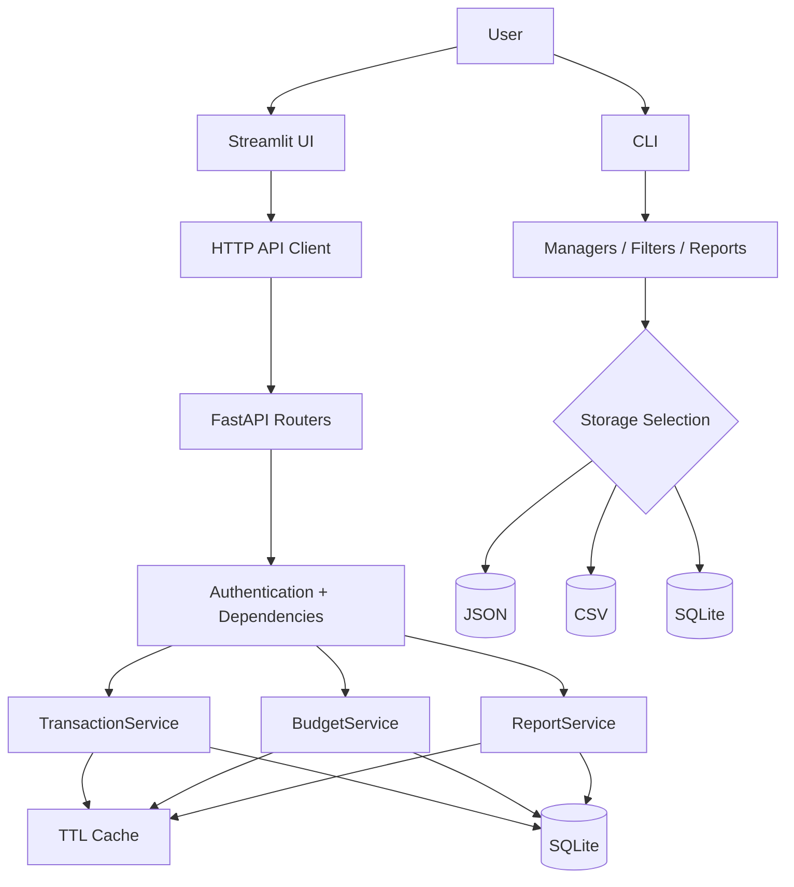

# ⚙️ Personal Finance Analytics System — Architecture

This document describes how the application is organized internally and how data moves between the Streamlit frontend, FastAPI backend, service layer, cache, storage implementations, and CLI.

---

## 🧩 1. System Overview

The project exposes two separate application paths:

1. **Web path** — Streamlit → FastAPI → services → SQLite/cache
2. **CLI path** — terminal menu → managers/helpers → JSON/CSV/SQLite



This split lets the web application use authenticated multi-user storage while the CLI can still demonstrate multiple persistence strategies.

---

## 🌐 2. FastAPI Layer

### Application Entry Point

`src/personal_finance_analytics_system/api/app.py` creates the FastAPI application, registers error handlers, adds request/response logging middleware, and mounts all routers under:

```text
/api/v1
```

### Router Responsibilities

| Router | Responsibility |
|---|---|
| `auth.py` | Registration, login, current-user endpoint |
| `transactions.py` | Create, retrieve, filter, and summarize transactions |
| `budgets.py` | Category budgets and budget statuses |
| `reports.py` | Monthly/date-range reports and downloads |
| `system.py` | Root, health, version, and public configuration responses |

API request and response models are defined in `api/schemas.py` using Pydantic.

---

## 🔐 3. Authentication & User Isolation

### Password Storage

Passwords are never stored as plain text. `auth.py` uses `pwdlib.PasswordHash.recommended()` to hash passwords and verify login attempts.

### JWT Access Tokens

Successful login returns a signed JWT containing the user's ID in the `sub` claim.

Current defaults:

- Algorithm: `HS256`
- Lifetime: **30 minutes**
- Secret environment variable: `FINANCE_JWT_SECRET_KEY`

The repository includes a development fallback secret, so production-style use should always provide a different environment value.

### Protected Requests

`get_current_user()` reads the bearer token, decodes the user ID, reloads that user from storage, and rejects missing, expired, invalid, or orphaned tokens with HTTP `401`.

### Data Isolation

Authenticated service dependencies construct storage instances with the current `user_id`. SQLite reads and writes include that user ID, which keeps one user's transactions and budgets separate from another user's data.

Cache keys also include a user-specific namespace, preventing cached results from being shared across accounts.

---

## 🧠 4. Service Layer

The API does not place all finance logic directly inside route functions. Routers validate HTTP-level concerns and then delegate workflows to services.

### TransactionService

Responsibilities include:

- list/filter transactions
- retrieve a transaction by ID
- create transactions
- calculate summary totals
- cache repeated reads
- invalidate user cache data after writes

### BudgetService

Responsibilities include:

- load stored category budgets
- create/update category budgets
- compare budgets with recorded expenses
- calculate remaining budget and percentage used
- return health states such as `healthy`, `warning`, or `exceeded`

### ReportService

Responsibilities include:

- monthly financial reports
- custom date-range reports
- income/expense/balance calculations
- savings-rate calculations
- category spending totals
- CSV export
- JSON export
- report caching

Reports reject an end date later than the current date.

---

## 💾 5. Storage Design

### API Storage

The authenticated API uses SQLite for:

- users
- transactions
- category budgets

Transaction records include a `user_id`, and API storage operations are scoped to the authenticated account.

### CLI Storage

The CLI asks the user to choose a persistence format at startup:

```text
1 JSON
2 CSV
3 SQLite
```

The storage-selection layer returns the implementation matching that choice, allowing the rest of the CLI to work against a consistent interface.

---

## ⚡ 6. Caching

`cache.py` implements a small in-memory, thread-safe TTL cache.

### Current Behaviour

- default TTL: **30 seconds**
- storage: Python dictionary
- synchronization: `threading.Lock`
- values are deep-copied on read/write
- stale values are removed when accessed

### Namespacing

Backend cache keys begin with a namespace containing:

```text
database path + user ID
```

This is then extended with values such as:

```text
transactions
transaction-summary
budget-statuses
date-range-report
```

When finance data changes, relevant cached data for that user is invalidated by prefix.

---

## 🖥️ 7. Streamlit Frontend

The Streamlit application lives in:

```text
src/personal_finance_analytics_system/streamlit_app/
```

### API Client

`api_client.py` sends HTTP requests to:

```text
http://127.0.0.1:8000/api/v1
```

This means the FastAPI backend needs to be running locally before the dashboard can perform authenticated finance operations.

### Main Pages

The authenticated sidebar exposes:

- Dashboard
- Add transaction
- Transactions
- Budgets
- Reports

The frontend stores the current access token and user email in Streamlit session state.

---

## ⌨️ 8. CLI Architecture

The CLI uses the original manager/helper classes directly rather than going through HTTP.

Important pieces include:

- `TransactionManager` — in-memory transaction collection
- `TransactionFilter` — category/type/date/amount filters
- `BudgetManager` — budget calculations
- `ReportManager` — monthly financial analytics
- `ReportExporter` — report output
- `ChartManager` — chart generation
- storage implementations — JSON, CSV, SQLite

This gives the repository two useful examples of application architecture: direct local orchestration in the CLI and layered client/server orchestration in the web application.

---

## 📊 9. Complexity Notes

Let:

- `n` = number of transactions for the current user
- `b` = number of configured budget categories

| Operation | Approx. Complexity |
|---|---:|
| Filter by one transaction field | `O(n)` |
| Calculate transaction summary | `O(n)` |
| Build a date-range report | `O(n)` |
| Build a monthly report | `O(n)` |
| Calculate all budget statuses | `O(b × n)` |
| In-memory cache lookup | `O(1)` average |
| Set/get one category budget in memory | `O(1)` average |

### Why Budget Status Is `O(b × n)`

Each category's status is calculated from the user's transaction list. As the number of budget categories grows, transaction scanning is repeated for each category.

### SQLite Operations

Database-level complexity depends on SQLite's query planner and indexes. The table uses an integer primary key for transaction IDs, while user-scoped collection reads still return the relevant rows for service-level filtering and aggregation.

---

## 🧪 10. Testing Strategy

The repository contains tests across both lower-level components and the API layer.

Coverage areas include:

- transaction validation and management
- transaction filtering
- JSON, CSV, and SQLite storage
- storage error handling
- budget calculations and persistence
- report generation and exports
- cache behavior
- authentication and token protection
- FastAPI routes and error handlers
- Streamlit API client behavior
- logging configuration

The project is configured to use `pytest`, `pytest-cov`, and Ruff through `pyproject.toml`.

---

## 🗂️ 11. Runtime Data

Local runtime files are intentionally excluded by `.gitignore`, including:

- `.env`
- SQLite databases
- generated JSON/CSV application data
- logs
- coverage output
- generated report images
- local virtual environments

This keeps local finance data and environment secrets out of source control.

---

## 🔄 12. Typical Request Flow

A transaction created through the web dashboard follows this path:

```text
Streamlit form
    ↓
API client
    ↓
POST /api/v1/transactions
    ↓
Bearer-token authentication
    ↓
TransactionService
    ↓
SqliteStorage(user_id=current user)
    ↓
SQLite insert
    ↓
User cache invalidation
    ↓
API response
    ↓
Updated Streamlit view
```

That flow captures the central design of the web side of the project: the frontend remains thin, the API owns authentication, services own workflows, and storage classes own persistence.
