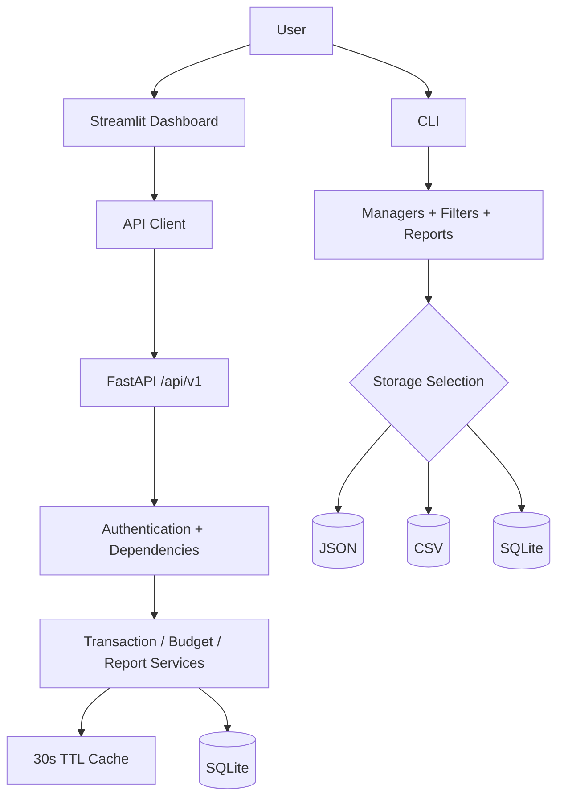

<div align="center">

<h1>💰 Personal Finance Analytics System</h1>

<h2>Track spending, manage budgets, explore reports, and access the same finance data through a web dashboard, REST API, or CLI</h2>

<p>
  
  
  
  
  
  
</p>

<p>
A full-stack personal finance application with authenticated multi-user data, transaction tracking, category budgets, financial reports, exports, caching, logging, and multiple storage options.
</p>

</div>

---

## ✨ What the System Does

The project started as a finance tracker and grew into a layered application with three ways to use the same core functionality:

- **Streamlit dashboard** for an authenticated graphical interface
- **FastAPI backend** for transactions, budgets, reports, and user accounts
- **Command-line interface** with selectable JSON, CSV, or SQLite storage

### 💳 Transactions

- Record both **income** and **expenses**
- Store amount, category, description, and transaction date
- Filter by category, type, date, and amount range
- View total income, expenses, balance, and transaction count
- Keep API transactions isolated by authenticated user

### 🎯 Budgets

- Create or update budgets for individual spending categories
- Compare actual spending against each budget
- Track remaining amount and percentage used
- Surface `healthy`, `warning`, and `exceeded` budget states

### 📊 Reports & Analytics

- Generate monthly reports
- Generate reports for custom date ranges
- Calculate income, expenses, balance, and savings rate
- Break expenses down by category
- Export reports as **CSV** or **JSON**
- Generate category-spending and summary charts from the CLI

### 🔐 Accounts & Security

- Register and sign in using email and password
- Hash passwords using `pwdlib`'s recommended password hasher
- Protect API routes with bearer-token authentication
- Use signed JWT access tokens with a 30-minute default lifetime
- Scope transaction, budget, report, and cache data to the current user

---

## 🖥️ Three Ways to Use It

### 🌐 Streamlit Dashboard

The Streamlit frontend is the main visual interface. After authentication, the sidebar provides access to:

- **Dashboard** — summary metrics, recent transactions, and budget health
- **Add transaction** — record income or expenses
- **Transactions** — browse and filter financial activity
- **Budgets** — set category limits and inspect spending status
- **Reports** — analyze a date range and download CSV/JSON reports

The frontend communicates with the FastAPI backend rather than accessing the database directly.

### ⚡ REST API

All application endpoints are grouped under `/api/v1`.

| Area | Method & Endpoint | Purpose |
|---|---|---|
| Authentication | `POST /auth/register` | Create an account |
| Authentication | `POST /auth/login` | Receive a bearer token |
| Authentication | `GET /auth/me` | Read the signed-in user |
| Transactions | `GET /transactions` | List and filter transactions |
| Transactions | `POST /transactions` | Create a transaction |
| Transactions | `GET /transactions/{id}` | Retrieve one transaction |
| Transactions | `GET /transactions/summary` | Get income, expense, balance, and count totals |
| Budgets | `GET /budgets` | List category budgets |
| Budgets | `PUT /budgets/categories/{category}` | Create or update a budget |
| Budgets | `GET /budgets/status` | Compare budgets with spending |
| Reports | `GET /reports` | Generate a date-range report |
| Reports | `GET /reports/monthly/{month}` | Generate a monthly report |
| Reports | `GET /reports/download` | Download CSV or JSON report data |

FastAPI also exposes interactive API documentation at `/docs` while the backend is running.

### ⌨️ Command-Line Interface

The CLI supports a separate local workflow and lets you choose between:

- JSON storage
- CSV storage
- SQLite storage

From the menu you can add transactions, configure budgets, filter records, generate monthly reports, export data, and create charts.

---

## 🧠 How It Is Structured

The project separates interface code, API routing, business workflows, storage, and reusable finance logic instead of putting everything into one application file.



### Service Layer

The backend uses dedicated service objects for the main workflows:

- `TransactionService` — filtering, retrieval, creation, summaries, and cache invalidation
- `BudgetService` — category budgets and budget-status calculations
- `ReportService` — monthly/date-range reports and CSV/JSON exports

### Storage Layer

The API uses SQLite for authenticated user data. The CLI additionally supports JSON and CSV storage through a storage-selection layer.

### Caching

A thread-safe in-memory TTL cache stores frequently requested transaction lists, summaries, budget statuses, and reports for **30 seconds**. Cache keys are namespaced per database and user so cached finance data does not cross account boundaries.

For a deeper breakdown, see **[ARCHITECTURE.md](ARCHITECTURE.md)**.

---

## 📈 Implementation & Complexity

Most analytical operations work over the current user's transaction collection. If `n` is the number of transactions and `b` is the number of configured budget categories:

| Operation | Approx. Complexity | Notes |
|---|---:|---|
| Transaction filtering | `O(n)` per active filter | Filters scan the loaded transaction list |
| Financial summary | `O(n)` | Income and expenses are aggregated across transactions |
| Date-range report | `O(n)` | Filters the range and aggregates totals/categories |
| Monthly report | `O(n)` | Aggregates matching transactions for a month |
| Budget status calculation | `O(b × n)` | Spending is evaluated across transactions for each category |
| Cache lookup | `O(1)` average | Python dictionary lookup under a lock |

SQLite still handles persistence and direct ID-based retrieval, while the service layer performs the application's reporting and filtering logic in Python.

---

## 🛠️ Tech Stack

| Technology | Role |
|---|---|
| **Python 3.13+** | Application language |
| **FastAPI** | REST API and request validation |
| **Streamlit** | Authenticated web dashboard |
| **SQLite** | Persistent API storage for users, transactions, and budgets |
| **Pydantic** | API request/response schemas and validation |
| **PyJWT** | Signed access tokens |
| **pwdlib / Argon2** | Password hashing |
| **Pandas / NumPy** | Data-oriented frontend and analytics support |
| **Matplotlib / Seaborn** | CLI chart generation |
| **httpx** | Streamlit-to-API requests |
| **pytest / pytest-cov** | Automated testing and coverage |
| **Ruff** | Linting and import/style checks |
| **uv** | Python environment and dependency management |

---

## 🚀 Getting Started

### 1. Clone the Repository

```bash
git clone https://github.com/fizza-org/personal-finance-analytics-system.git
cd personal-finance-analytics-system
```

### 2. Install Dependencies

The project requires **Python 3.13 or newer** and uses `uv`.

```bash
uv sync
```

### 3. Configure the JWT Secret

The application includes a development fallback secret, but you should provide your own value when running it locally.

**Linux / macOS**

```bash
export FINANCE_JWT_SECRET_KEY="replace-with-a-long-random-secret"
```

**PowerShell**

```powershell
$env:FINANCE_JWT_SECRET_KEY="replace-with-a-long-random-secret"
```

Optional logging configuration:

```text
APP_ENV=development
LOG_LEVEL=INFO
```

### 4. Start the FastAPI Backend

```bash
uv run python -m personal_finance_analytics_system.api.app
```

The backend runs on:

```text
http://127.0.0.1:8000
```

Interactive API docs:

```text
http://127.0.0.1:8000/docs
```

### 5. Start the Streamlit Dashboard

Open a second terminal while the API is still running:

```bash
uv run streamlit run src/personal_finance_analytics_system/streamlit_app/app.py
```

The Streamlit client expects the backend at `http://127.0.0.1:8000/api/v1`, so start the API first.

### 6. Run the CLI Instead

The command-line version can be launched independently:

```bash
uv run python -m personal_finance_analytics_system.cli
```

You will be prompted to choose JSON, CSV, or SQLite storage.

---

## 🧪 Testing & Code Quality

Run the test suite:

```bash
uv run pytest
```

Run tests with coverage:

```bash
uv run pytest --cov=personal_finance_analytics_system --cov-report=term-missing
```

Run Ruff:

```bash
uv run ruff check .
```

The repository contains unit and API tests covering authentication, protected routes, transactions, budgets, reports, storage backends, caching, validation, logging, and the Streamlit API client.

---

## 📁 Project Structure

```text
personal-finance-analytics-system/
├── src/personal_finance_analytics_system/
│   ├── api/
│   │   ├── routers/              # Auth, transactions, budgets, reports, system
│   │   ├── app.py                # FastAPI application
│   │   ├── dependencies.py       # Authenticated service dependencies
│   │   └── schemas.py            # API request/response models
│   ├── services/                 # Backend business workflows
│   ├── streamlit_app/            # Web dashboard and API client
│   ├── auth.py                   # Password hashing and JWT handling
│   ├── budget_manager.py         # Budget calculations
│   ├── cache.py                  # Thread-safe TTL cache
│   ├── chart_manager.py          # Chart generation
│   ├── cli.py                    # Command-line interface
│   ├── csv_storage.py            # CSV transaction persistence
│   ├── json_storage.py           # JSON transaction persistence
│   ├── sqlite_storage.py         # SQLite transaction persistence
│   ├── sqlite_budget_storage.py  # SQLite budget persistence
│   ├── report_manager.py         # Financial calculations
│   └── transaction_filter.py     # Transaction filtering helpers
├── tests/                         # Unit and API tests
├── reports/                       # Generated/exported report examples
├── .streamlit/config.toml         # Streamlit theme configuration
├── ARCHITECTURE.md                # Architecture and implementation notes
├── pyproject.toml                 # Project metadata and dependencies
└── uv.lock                        # Reproducible dependency lockfile
```

Runtime databases, logs, local environment files, generated charts, and other application data are excluded through `.gitignore`.

---

## 🔍 Architecture Notes

The technical documentation covers the application's layers, authentication flow, user isolation, storage choices, caching strategy, report pipeline, and important implementation trade-offs.

### 📘 [Read the Architecture Documentation](ARCHITECTURE.md)

---

## 📌 Project Focus

This project demonstrates how a small finance tracker can be evolved into a more complete application by separating concerns across **frontend, API, service, storage, security, reporting, and testing layers** while keeping the core finance logic reusable across different interfaces.
